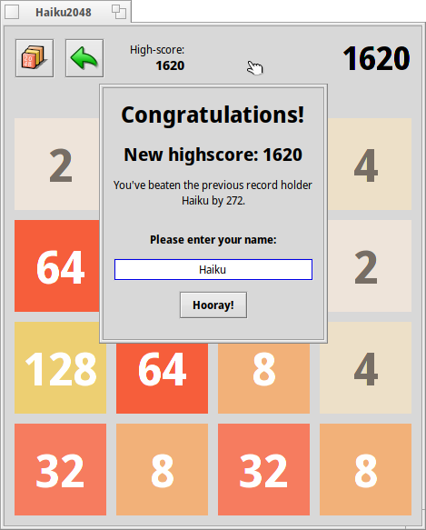

# Haiku 2048

## A 2048 clone for [Haiku OS](https://haiku-os.org/).

### Build

Simply go to the source directory and run `make`

### How to play (if you never played 2048 before)

You should see the main game window with a 4 by 4 grid. There also should be a small square labeled `2` and a square labeled `4`. "Push" the squares to the edges using the arrow keys.

You should see another square labeled `2` after you made a move. Try putting the squares in the same row or column and move them using the arrow keys so they combine with each other.

Your goal is to combine these squares until you get the ultimate sum of 2048.

### Made a wrong move?
No problem! Simply press the green arrow at the top left corner of the window to take back a move.

### Frustrated and want to start over?
Simply press the leftmost button on the top left corner of the window (the one next to the green arrows) to restart your game!

